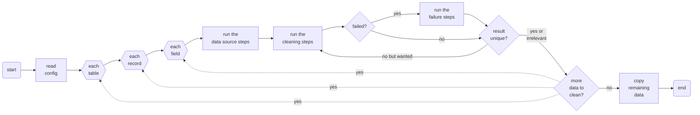

# DumpCleaner

DumpCleaner is a tool that can randomize or anonymize your database dumps. Currently, it works with the [MySQL Shell Dump](https://dev.mysql.com/doc/mysql-shell/8.4/en/mysql-shell-utilities-dump-instance-schema.html) format (other formats may be added later).

_Even though we use DumpCleaner in our production setup, this project still beta quality and may experience breaking changes._

## Why?

The main purpose of this tool is to provide a **safe way to work with production data during development**. Often, production databases can easily fit into the developers’ computers and if they don’t, the database tools usually provide a way to [dump a _subset_](https://dev.to/nejremeslnici/mysql-shell-the-best-tool-for-your-logical-backups-44fk#partial-imports-of-the-logical-dumps) of the data (and leave the audit logs behind, for example).

We believe that working with production data has several benefits over developing against a near-empty and/or a completely made-up data set:

- The volume of data in various tables reflects the production volume. This helps uncover slow queries, missing indices, or unoptimized data retrieval patterns much earlier in the development loop.
- This also provides better constraints for the UX design. There is a difference between building a screen with a list having 10 test records vs. 10 thousand production records.
- The data that developers work with is realistic. [Faker](https://github.com/faker-ruby/faker) is nice but it can never reach the breadth and variety of real data made by real people using your app.
- Developers don’t have to access the production database (they don’t even have to have the privileges to access it) to test their hypotheses about the data or learn the common patterns or edge cases.

That said, having an exact production data copy at developers’ machines is insecure and could lead to personal data leaks and violations of GDPR or similar legislation. Moreover, developers usually do not—or should not—need to work with real individual data records, they rather need **a realistic-enough approximation** of the data. That’s where the DumpCleaner’s main feature, a high-fidelity data anonymization / randomization, should come in handy.

### The goals of this project

- DumpCleaner works with **database _dumps_** rather than databases themselves. Doing that, it fits nicely into the process of cloning the production data to the developer machines.
- It produces **high-fidelity data** during the randomization / anonymization, for example it allows to replace:
  - an individual’s phone number with a random number from the same phone carrier,
  - a gmail.com email address with a different random mailbox at gmail.com,
  - a user’s geographic location with a random location within a few miles from the original one,
  - someone’s name with a random name taken from a dictionary of names you specify,
  - someone’s IP address with a random IP address having the same prefix (same or similar subnet),
  - and so on…
- It works **deterministically**, i.e. multiple runs over the same source data  result in the same cleaned data.
- It can generate **unique data** across a given table column if needed.
- It can **ignore certain columns and/or records** in the dump based on a set of conditions to e.g. skip randomizing contact information of internal admin users.
- It obeys the inherent limits of the given dump format, if any (for example, it takes great care to keep the length and byte size of the updated data the same as original so as not to corrupt the MySQL Shell dump chunk index files).

All in all, DumpCleaner is just a „more specialized and configurable `awk`“, i.e. a text replacement tool.

#### Non-goals and limitations

- This is not an effort to fully anonymize all production personal data according to GDPR rules. In simple cases DumpCleaner might achieve that but in general it is probably not performant and flexible enough for such task.
- The quality of the data randomization often relies heavily on the quality of source dictionaries. There is only a small effort for the tool to be able to _fake_ high fidelity data ”out of nothing“, there are [other tools](https://github.com/faker-ruby/faker) for that. If you need the resulting data to be more specific, you can usually prepare a more specific dictionary for your domain.
- Speed: while this tool can process millions of records in a few minutes, there are currently no speed optimizations applied or planned. This is probably not a good tool for live anonymization of bigger amounts of data. It is rather meant to be run as a background task somewhere on your server during the night, just after it dumps out the database backups.
- The cleaning process is currently stateless in the sense that one cleaned-up record field knows nothing about other cleaned-up fields in the same record.
- Currently, DumpCleaner works with the [MySQL Shell Dump](https://dev.mysql.com/doc/mysql-shell/8.4/en/mysql-shell-utilities-dump-instance-schema.html) format under default settings (mainly because [we use it ourselves](https://dev.to/nejremeslnici/mysql-shell-the-best-tool-for-your-logical-backups-44fk)) but other formats may be added later.

## Installation

Install the gem and add to the application's Gemfile by executing:

    $ bundle add dump_cleaner

If bundler is not being used to manage dependencies, install the gem by executing:

    $ gem install dump_cleaner

## Usage

The gem provides a `dump_cleaner` executable that must be called with the following arguments:

```sh
$ dump_cleaner -f <source_dump_path> -t <destination_dump_path> [-c <config_file>]
```

where:
- `-f` / `--from=` sets the path to the source (original, non-anonymized) data dump; for MySQL Shell this is the directory with the dump created by the MySQL Shell dump utility
- `-t` / `--to=` sets the path to the destination (anonymized) data dump; for MySQL Shell this is the directory with the dump which will be created or overwritten by DumpCleaner
- `-c` / `--config=` sets the path to the [configuration file](#configuration) (default: `config/dump_cleaner.yml`); the configuration is documented below

### A basic example

The repository includes a [sample MySQL Shell dump](https://github.com/NejRemeslnici/dump-cleaner/tree/main/spec/support/data/mysql_shell_dump) that has been produced by [running](https://dev.mysql.com/doc/mysql-shell/8.4/en/mysql-shell-utilities-dump-instance-schema.html#mysql-shell-utilities-dump-opt-run) the MySQL Shell dump utility against a `db` database:

```
MySQLShell JS> util.dumpSchemas(["db"], "mysql_shell_dump");
```

The dump contains a `users` table with the following sample contents:

```sh
$ zstdcat mysql_shell_dump/db@users@@0.tsv.zst

# id    name         email                         phone_number
1       Johnson      johnson@gmail.com             +420774678763
2       Smith        amiright@example.com          +420733653796
3       Williams     anette.williams@example.com   N/A
```

Now, after running DumpCleaner with the following options including a [certain config file](https://github.com/NejRemeslnici/dump-cleaner/blob/main/spec/support/data/mysql_shell_dump_cleaner.yml):

```sh
$ dump_cleaner -f mysql_shell_dump -t mysql_shell_anonymized_dump \
               -c mysql_shell_dump_cleaner.yml
```

a destination dump directory gets created with a copy of the source dump but with the data in the `users` table randomized, in this case in the following way:

```sh
$ zstdcat mysql_shell_anonymized_dump/db@users@@0.tsv.zst

# id    name         email                         phone_number
1       Jackson      variety@gmail.com             +420774443735
2       Allen        contains@present.com          +420733637921
3       Harrison     should.visitors@program.com   N/A
```

There are a few things to note here:
- The names or mail boxes are replaced by random words from the dictionary specified in the config file.
- The replacements did not change the size of the data (actually it keeps the byte size, too).
- The well-known email domains as well as phone number carrier prefixes have been kept but other parts of the data randomized.
- Some values were ignored (`N/A`) as specified in the config file.

If DumpCleaner was run once again over the same source data and using the same config, it would produce exactly the same randomized data in the output.

_Read on if you are interested in more details about how DumpCleaner works, otherwise you can safely skip to the [Configuration](#configuration) section._

### How does DumpCleaner work?

DumpCleaner first reads the [config file](#configuration). From the configuration, it finds the tables and columns that need to be sanitized by the cleaning process. It parses the dump data for each table, extracts the fields from each record and runs the following workflows for each to-be-cleaned field:

- A **”data source“ workflow** that grabs the data for the given data type that will be needed for the cleaning workflow that comes next. This data is then cached.
- A **”cleaning“ workflow** usually further extracts the relevant part from the somewhat generic source data based on the individual field value and then, more importantly, ”cleans“ the field value by randomizing or anonymizing it somehow.
- Optionally, a **”failure“ workflow** which serves as the last resort when the previous steps fail for some reason (return a `nil` value). This workflow usually replaces the field value with a random one.

After all configured table columns have been cleaned, the tool copies the remaining data from the original dump so that the destination dump is complete and ready for re-import.

The overall process is summarized in the diagram below, too:



### Unique values

A particular column in a table may be configured to require unique randomized data. In that case, the cleaning process is repeated until it produces a unique randomized value, or until max retries limit is reached (currently 1000).

The cleaning workflow steps usually just add a numeric suffix to the randomized value, without increasing its length (and byte size). For example, if the sanitized value is `something`, its unique variant may become `somethin1` or even `somethi99`. Some cleaning steps, on the other hand, allow repeatedly taking a random value from the dictionary instead of adding a suffix.

When max retries is reached, DumpCleaner prints an error and switches to the failure workflow for further processing.

### Randomization is deterministic

To achieve a deterministic randomness when cleaning the data, each random number generation is seeded with a [value](https://github.com/NejRemeslnici/dump-cleaner/blob/main/lib/dump_cleaner/cleanup/cleaning_steps/base.rb#L21) reflecting **the identity of the current record** (usually it’s primary key value) and the field original value. This guarantees that the same source data in the same record will be always cleaned up to the same randomized data.

There are some practical limits to this consistency though:

- if the randomization works with a dictionary and that dictionary is updated, the cleaned data will change, too, and
- if [uniqueness](#unique-values) of a column is requested, the randomization process is retried for that field until a unique value is found; this makes the randomization rely on the values of the previously encountered conflicting values and if _any_ of them changes in the source data, the final cleaned value changes, too.

NOTE: The fact that the [RNG](https://en.wikipedia.org/wiki/Random_number_generation) seed is also dependent on the primary key has one more potentially undesired consequence: the same original value will be cleaned to different values in records with different primary keys, thus adding an artificial variance to the data. We will look into this issue in a future release.

## Configuration

A basic DumpCleaner configuration file might look like this:

```yaml
dump_cleaner:
  log_level: info

dump:
  format: mysql_shell

cleanup_tables:
  - db: db
    table: users
    columns:
      - name: name
        cleanup_type: last_name
      - name: e_mail
        cleanup_type: email
        unique: true
      - name: phone_number
        cleanup_type: phone_number_intl
    record_context_columns:
      - id
      - admin_flag
    keep_same_record_conditions:
      - column: admin_flag
        condition: non_zero
    # id_column: user_id (not useful in this table)

cleanup_types:
  last_name:
    data_source:
      - step: LoadYamlFile
        params:
          file: spec/support/data/dict/last_names.yml
      - step: GroupByBytesize
    cleaning:
      - step: SelectDataByBytesize
      - step: TakeSample
    failure:
      - step: FillUpWithString

  email:
    data_source:
      ...
    cleaning:
      - step: RandomizeEmail
    failure:
      - step: FillUpWithString

  phone_number_intl:
    cleaning:
      - step: RandomizeFormattedNumber
        params:
          # +420123456789
          format: (?<front>\+(?:\d{6}))(?<x>\d{6})
    failure:
      - step: FillUpWithString
    keep_same_conditions:
      - condition: eq
        value: "N/A"
```

The individual config options are as follows:

### `dump_cleaner`

This allows setting the log level using the `log_level` property. The DumpCleaner log output is printed to `STDOUT` and the default log level is `INFO`.

### `dump`

This setting currently only defines the format of the data dump using the `format` property. The only recognized format now is `mysql_shell`.

### `cleanup_tables`

This is where things get more interesting. The `cleanup_tables` key specifies which tables (via the `db` and `table` properties) and their columns (via the `name` property nested inside the `columns` array) should be cleaned and what `cleanup_type` each column is, i.e. which variant of the cleanup process will be used for it. Optionally, a column may also include a `unique` property: when set to `true` the randomized values in this column will be guaranteed to be unique across the table.

Optionally, an `id_column` key may be given that determines the foreign key which is responsible for determining the identity of the table records (see the [Randomization](#randomization-is-deterministic) section above). For example a table that [belongs_to](https://guides.rubyonrails.org/association_basics.html#the-belongs-to-association) the `users` table might have the `id_column` set to `user_id` and this would ensure that the values in this table would be randomized the same as the corresponding values in the `users` table, keeping consistency across the associated tables. This property defaults to `"id"`.

Optionally, the `keep_same_conditions` key may also hold [conditions](#keep_same_conditions) for ignoring the cleanup of a record from the table. When the conditions evaluate to a truthy value for the record, none of its fields gets cleaned. This is useful if you want to keep some records (say admin users) in the original state.

The optional `record_context_columns` property may define a list of columns the source values of which should be available for the cleaning workflows. This is currently used when evaluating the `keep_same_conditions`. (This could probably be refactored out as it unnecessarily duplicates the configuration a bit.)

### `cleanup_types`

The core of the sanitization process lies here. Under this key the relevant steps for the `data_source`, `cleaning` or `failure` workflows are specified, each with optional `params`. In general, the output of one step makes the input of the following step. It is considered an error if a `cleaning` step returns a `nil` value and that’s when the processing switches to the `failure` workflow.

**See the [Workflow steps page](doc/workflow_steps.md) for the individual steps documentation.**

Optionally, under the `keep_same_conditions` property, [conditions](#keep_same_conditions) for ignoring the cleanup of the given cleanup type may be given. If they evaluate to true for the currently processed field value, it’s cleanup is skipped and the original value is returned.

Finally, the optional `ignore_keep_same_record_conditions` property may be set to true to indicate that current field value should be always cleaned, even if the `keep_same_conditions` were used for the whole record at the `cleanup_table` level.

### `keep_same_conditions`

The `keep_same_conditions` property may define a list of conditions that will prevent cleaning up the given field or record. Each condition is a hash that consists of the following properties:

- `column` - defines the column in the table that the condition should take the field’s value from (this is useful only when using the `keep_same_conditions` under the [`cleanup_tables`](#cleanup_tables) configuration key whereas in the `cleanup_types` context the column is implied),
- `condition` - specifies the operator or function that the condition should evaluate; currently supported values here are:
  - `eq` - tests with `==`
  - `ne` - tests with `!=`
  - `start_with` - tests strings with the [`start_with?` method](https://ruby-doc.org/3.3.2/String.html#method-i-start_with-3F)
  - `end_with` - tests strings with the [`end_with?` method](https://ruby-doc.org/3.3.2/String.html#method-i-end_with-3F)
  - `non_zero` - converts the value to an integer and tests if it is different from zero,
- `value` - the value to evaluate the condition against (some operators may not use a value, such as `non_zero`).

If multiple conditions are specified, they are logically OR-ed, i.e. if _any_ of the conditions yields true, the whole statement yields true and the record or field cleaning is skipped.

## Ideas for future development

- The issue with random seeds being dependent on the primary key (and thus artificially increasing data variance): this behavior should probably be optional.
- The `RandomizeFormattedNumber` step could be generalized to `RandomizeFormattedString`, allowing to replace any matching part of the string with not only numbers, but alphanumeric etc. as well. The `RandomizeEmail` could then be rewritten using this new step.

## Development

After checking out the repo, run `bin/setup` to install dependencies. Then, run `rake spec` to run the tests. You can also run `bin/console` for an interactive prompt that will allow you to experiment.

To install this gem onto your local machine, run `bundle exec rake install`.

## Contributing

Bug reports and pull requests are welcome [on GitHub](https://github.com/NejRemeslnici/dump-cleaner/issues).

## License

The gem is available as open source under the terms of the [MIT License](https://opensource.org/licenses/MIT).
