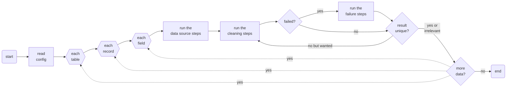

# DumpCleaner

DumpCleaner is a tool that can randomize or anonymize your database dumps. Currently, it works with the [MySQL Shell Dump](https://dev.mysql.com/doc/mysql-shell/8.4/en/mysql-shell-utilities-dump-instance-schema.html) format (other formats may be added later).

## Why?

The main purpose of this tool is to provide a **safe way to work with production data during development**. Often, production databases can easily fit into the developers’ computers and if they don’t, the database tools usually provide a way to [dump a _subset_](https://dev.to/nejremeslnici/mysql-shell-the-best-tool-for-your-logical-backups-44fk#partial-imports-of-the-logical-dumps) of the data (and leave the audit logs behind, for example).

We believe that working with production data has several benefits over developing against a near-empty and/or a completely made-up data set:

- The volume of data in various tables reflects the production volume. This helps uncover slow queries, missing indices, or unoptimized data retrieval patterns much earlier in the development loop.
- The data that developers work with is realistic. [Faker](https://github.com/faker-ruby/faker) is nice but it can never reach the breadth and variety of real data made by real people using your app.
- Developers don’t have to access the production database (they don’t even have to have the privileges to access it) to test their hypotheses about the data or learn the common patterns or edge cases.

That said, having an exact production data copy at developers’ local machines is insecure and could very well lead to personal data leaks and violations of GDPR or similar legislation. Developers usually do not need to know the exact version of an individual data record (say an individual user’s phone number), they need **a realistic-enough approximation** of the data (say a random number from the same phone carrier). That’s where the DumpCleaner’s main feature, a high-fidelity data anonymization / randomization, comes at hand.

### The goals of this project

- DumpCleaner works with **database _dumps_** rather than databases themselves. Doing that, it fits nicely into the process of cloning the production data to the developer machines.
- It produces **high-fidelity data** during the randomization / anonymization, for example it allows to replace:
  - an individual’s phone number with a random number from the same phone carrier,
  - a gmail.com email address with a different random mailbox at gmail.com,
  - a user’s geographic location with a random location within a few miles from the original one,
  - someone’s name with another random name taken from a dictionary of names you specify,
  - someone’s IP address with a random IP address having the same prefix (same or similar subnet),
  - and so on…
- It works **deterministically**, i.e. multiple runs over the same source data usually result in the same cleaned data.
- It can generate **unique data** across a given table column if needed.
- It can **ignore certain columns and/or records** in the dump based on a set of conditions to e.g. NOT randomize data about certain admin users.
- It obeys the inherent limits of the given dump format, if any (for example, it takes great care to keep the length and byte size of the updated data the same as original so as not to corrupt the MySQL Shell dump chunk index files).

All in all, this tool is just a „more clever and configurable `awk`“, i.e. a text replacement tool.

#### Non-goals and limitations

- This is not an effort to fully anonymize all production personal data according to GDPR rules. In simple cases DumpCleaner might achieve that but in general it is probably not performant and flexible enough.
- The quality of the data randomization often relies heavily on the quality of source dictionaries. There is only a small effort for the tool to be able to _fake_ high fidelity data regardless of the dictionaries, there are [other tools](https://github.com/faker-ruby/faker) for that. If you need the resulting data to be more specific, you can usually prepare a more specific dictionary for your domain.
- Speed: while this tool can process millions of records in a few minutes, there are currently no speed optimizations applied or planned. This is probably not a good tool for live anonymization of bigger amounts of data. It is rather meant to be run as a background task somewhere on your server during the night, just after it dumps out the database backups.
- Currently, DumpCleaner works with the [MySQL Shell Dump](https://dev.mysql.com/doc/mysql-shell/8.4/en/mysql-shell-utilities-dump-instance-schema.html) format under default settings but other formats may be added later.

## Installation

TODO: Replace `UPDATE_WITH_YOUR_GEM_NAME_IMMEDIATELY_AFTER_RELEASE_TO_RUBYGEMS_ORG` with your gem name right after releasing it to RubyGems.org. Please do not do it earlier due to security reasons. Alternatively, replace this section with instructions to install your gem from git if you don't plan to release to RubyGems.org.

Install the gem and add to the application's Gemfile by executing:

    $ bundle add UPDATE_WITH_YOUR_GEM_NAME_IMMEDIATELY_AFTER_RELEASE_TO_RUBYGEMS_ORG

If bundler is not being used to manage dependencies, install the gem by executing:

    $ gem install UPDATE_WITH_YOUR_GEM_NAME_IMMEDIATELY_AFTER_RELEASE_TO_RUBYGEMS_ORG

## Usage

Using of the gem is easy (it is configuring it that is relatively more demanding, see below): the gem provides a `dump_cleaner` executable that should be called with a few arguments:

```sh
$ dump_cleaner -f <source_dump_path> -t <destination_dump_path> [-c <config_file>]
```

where:
- `-f` / `--from=` sets the path to the source (original, non-anonymized) data dump; for MySQL Shell this is the directory with the dump created by the MySQL Shell dump utility
- `-t` / `--to=` sets the path to the destination (anonymized) data dump; for MySQL Shell this is the directory with the dump which will be created or overwritten by DumpCleaner
- `-c` / `--config=` sets the path to the configuration file, see below (default: `config/dump_cleaner.yml`)

### How does DumpCleaner work?

DumpCleaner first reads the config file (see below for details). From the configuration, it finds the tables and columns that need to be sanitized by the cleaning process. It parses the dump data for each table, extracts the fields from each record and runs the following workflows for each field:

- A **”data source“ workflow** that grabs the data for the given data type that will be needed for the cleaning workflow that comes next.
- A **”cleaning“ workflow** usually further extracts the relevant part from the somewhat generic source data based on the field value and then, more importantly, ”cleans“ the field value by randomizing or anonymizing it somehow.
- Optionally, a **”failure“ workflow** which serves as a last resort when the previous steps fail for some reason (return a `nil` value). This workflow usually replaces the field value with a completely random one.

The overall process is summarized in the diagram below, too:



## Configuration


## Development

After checking out the repo, run `bin/setup` to install dependencies. Then, run `rake spec` to run the tests. You can also run `bin/console` for an interactive prompt that will allow you to experiment.

To install this gem onto your local machine, run `bundle exec rake install`. To release a new version, update the version number in `version.rb`, and then run `bundle exec rake release`, which will create a git tag for the version, push git commits and the created tag, and push the `.gem` file to [rubygems.org](https://rubygems.org).

## Contributing

Bug reports and pull requests are welcome on GitHub at https://github.com/borama/dump_cleaner.

## License

The gem is available as open source under the terms of the [MIT License](https://opensource.org/licenses/MIT).
